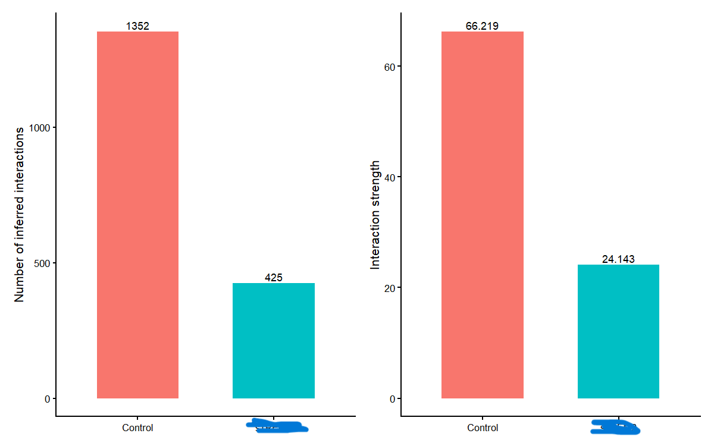
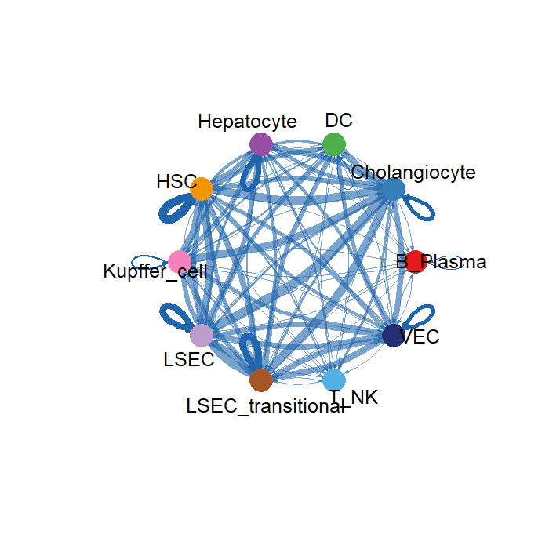
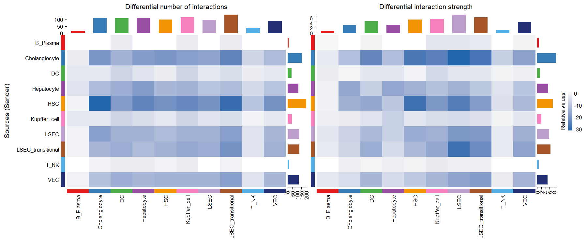
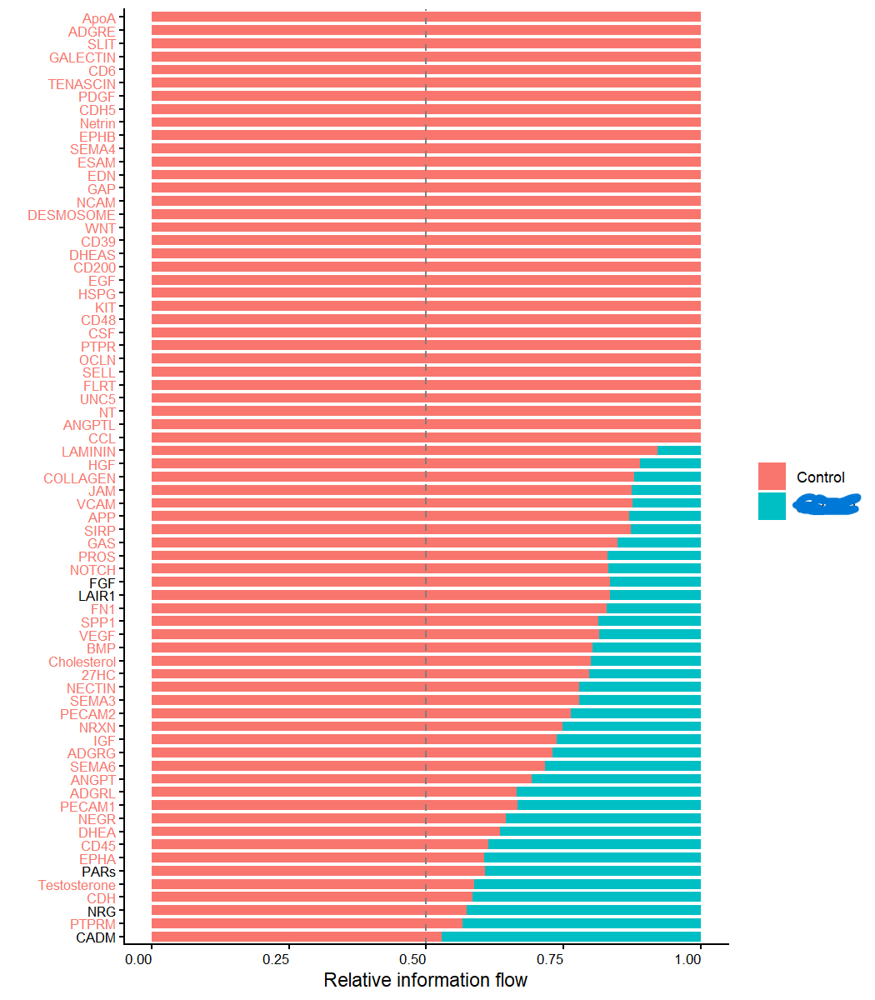
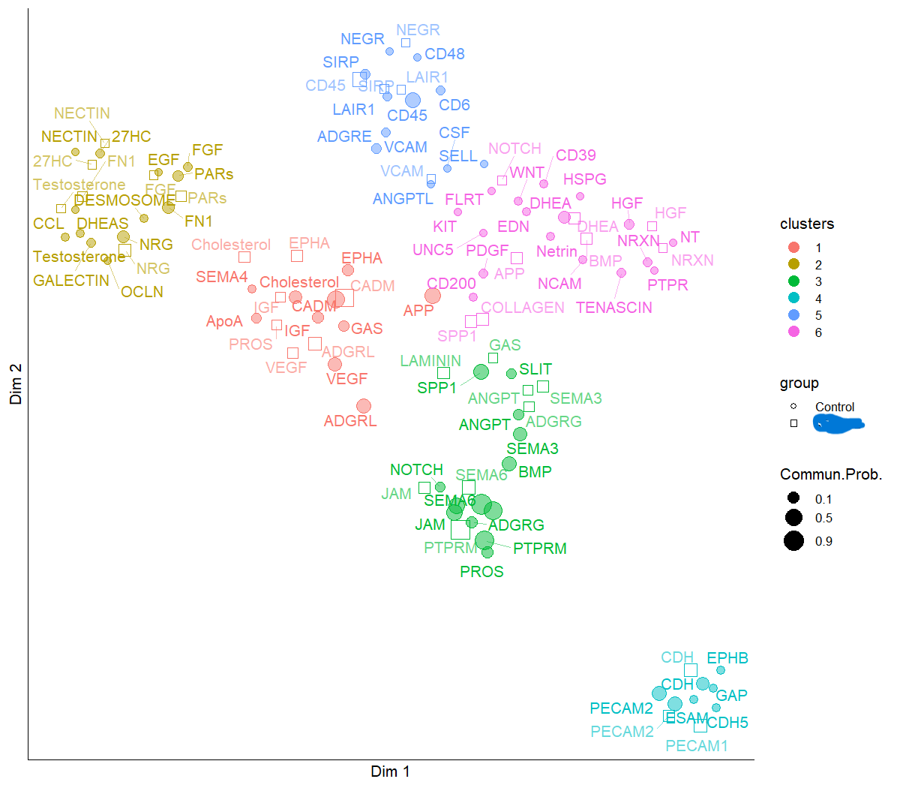
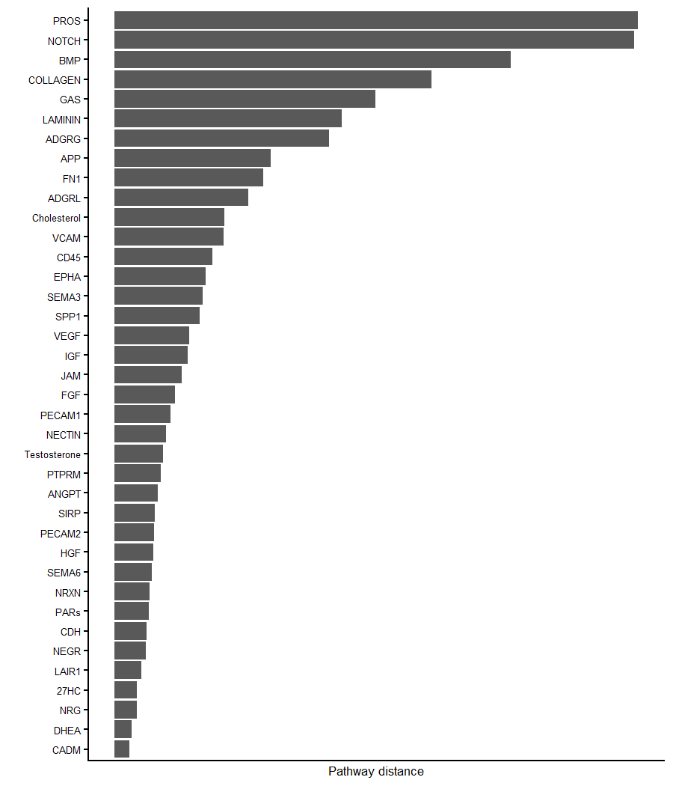
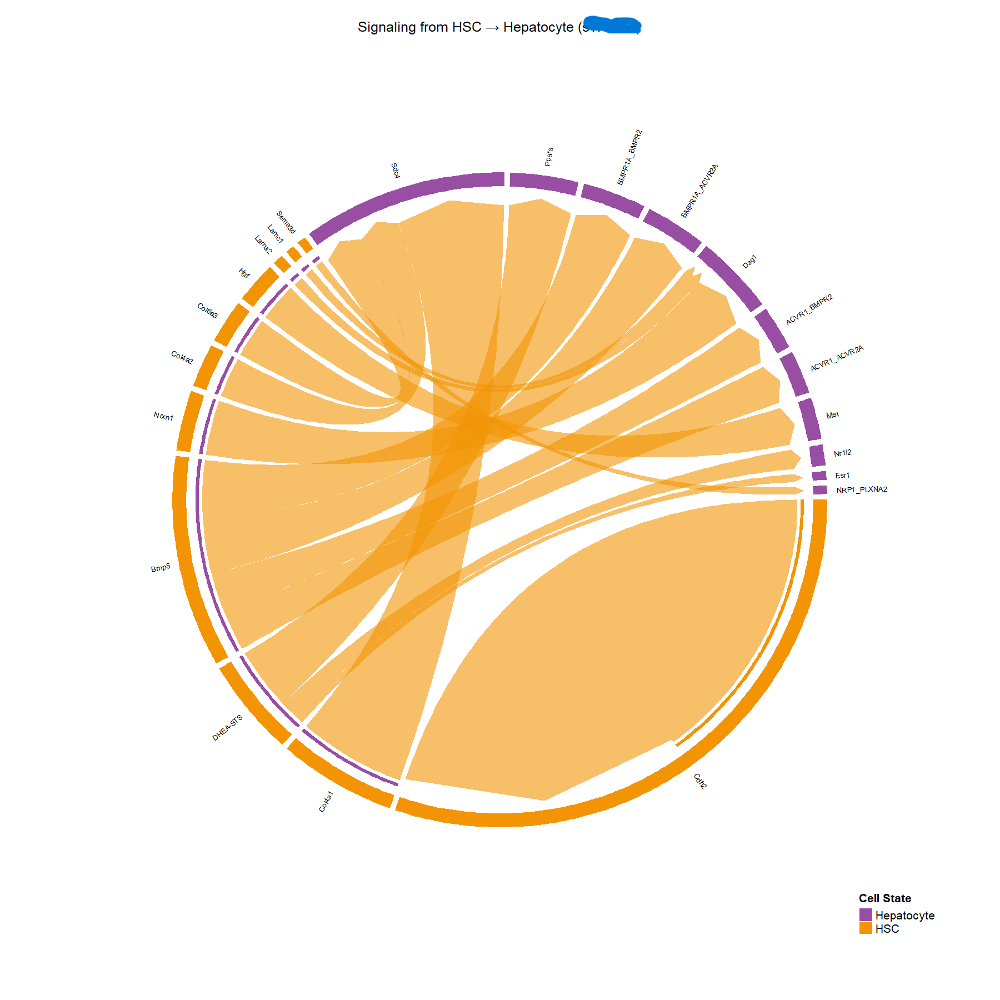

# CellChat Analysis: sTREM2 vs EGFP

## 🧠 Project Overview
This project investigates how **sTREM2 overexpression alters cell–cell communication** in liver using single-cell RNA-seq data and the CellChat framework.

We compare:
- **Control (EGFP)**
- **sTREM2 overexpression**

---

## 🔬 Biological Questions
- Does sTREM2 change overall communication strength?
- Which cell types are most affected?
- Which signaling pathways are altered?
- Are these changes due to signal strength or **network rewiring**?

---

## ⚙️ Analysis Workflow
1. Construct CellChat objects for each condition  
2. Infer cell–cell communication networks  
3. Compare interaction number and strength  
4. Identify differential signaling pathways  
5. Perform pathway-level analysis  
6. Detect network rewiring using embedding  
7. Analyze ligand–receptor interactions  

---

# 📊 Key Results

---

## 1️⃣ Global Communication Changes

sTREM2 shows a clear **reduction in both the number and strength of interactions**, indicating global suppression of cell–cell communication.

---

## 2️⃣ Differential Interaction Network

Communication between cell types is broadly reduced and reorganized in sTREM2, with many interactions lost.

---

## 3️⃣ Systematic Interaction Changes (Heatmap)

The heatmap highlights widespread decreases in signaling across multiple sender–receiver pairs.

---

## 4️⃣ Pathway-Level Changes

Most signaling pathways show reduced activity in sTREM2, indicating a global shift in pathway usage.

---

## 5️⃣ Network Rewiring (Most Important Result)

Pathway embedding reveals that several pathways change their cellular communication patterns, demonstrating **true network rewiring**, not just reduced signaling.

---

## 6️⃣ Condition-Specific Pathways

Top-ranked pathways show the strongest differences between control and sTREM2 and represent the most biologically relevant signaling changes.

---

## 7️⃣ Example Mechanistic Interaction (HSC → Hepatocyte)

Detailed ligand–receptor analysis highlights how specific signaling interactions between HSC and hepatocytes are altered under sTREM2.

---

# 🧬 Key Biological Insights

- Global reduction in intercellular communication in sTREM2  
- Loss of signaling diversity across pathways  
- Shift toward **dominant signaling axes**  
- Evidence of **network rewiring**, not just intensity changes  
- Altered ligand–receptor interactions driving communication differences  

---

# 📁 Repository Structure

- `scripts/` → analysis pipeline  
- `results/` → figures and outputs  

---

# ⚠️ Notes

- Raw data is not included  
- Analysis performed using `CellChatDB.mouse`  
- Sequential execution used to avoid memory issues  

---

# 👩‍🔬 Author
Nelly (nrezaei)
